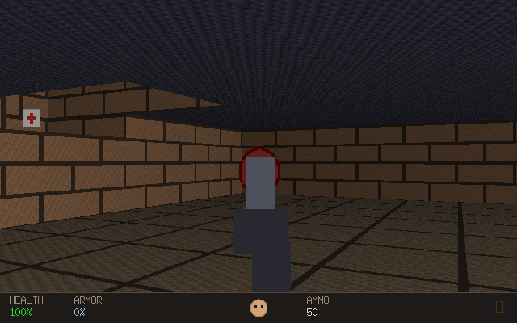

# pandemonium

A procedurally-generated, Wolfenstein-3D-style raycaster FPS written in Go with
[Ebiten](https://ebitengine.org/) v2, in the visual spirit of the original DOOM.

Every run drops you into a freshly generated maze of rooms and corridors — with
staircases, raised platforms and lifts sculpted into the terrain. Walk it with
`WASD`, look around with the mouse (or arrow keys), dodge the demons, and find
the exit — which collapses the level and generates a brand new one. Levels are
deterministic from a seed, so a given seed always produces the same world.

```
go run ./cmd/pandemonium --seed 42
```

[](docs/demos/hero.mp4)

*(click for the gameplay video)*

## Controls

| Input              | Action            |
| ------------------ | ----------------- |
| `W` / `S`          | Move forward/back |
| `A` / `D`          | Strafe left/right |
| Mouse / `←` `→`    | Turn              |
| Left-click / `Ctrl` / `F` | Attack     |
| `1` `2` `3` / wheel | Switch weapon    |
| `E`                | Interact (doors)  |
| `Tab`              | Toggle automap    |
| `Esc`              | Quit              |

## CLI

```
pandemonium [flags]

  --seed int      world seed (0 = random, printed on start)
  --width int     level width in tiles  (default 48)
  --height int    level height in tiles (default 32)
```

The chosen seed and the current level number are printed to stdout on start and
whenever a new level is generated, so demos are reproducible.

Sound is on by default. Set `PANDEMONIUM_NO_AUDIO=1` to run silently (handy on
machines without an audio device).

## Development

```
just build    # compile the binary into ./bin
just run      # build and run
just test     # run all tests
just lint     # golangci-lint
```

## Documentation

- [Architecture](docs/architecture.md) — the three decoupled layers.
- [How the raycaster works](docs/raycaster.md).
- [Demos](docs/demos.md) — more gameplay clips.
