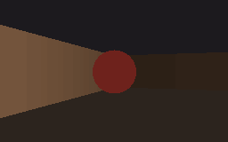
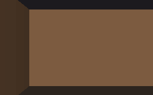

# Demos

Short clips of the game in action. Each is generated from a fixed seed, so the
runs are reproducible.

## Exploration

Walking a procedurally generated level from the spawn through its rooms and
corridors toward the exit.

## Looking around

A full turn on the spot, showing the per-column raycasting and distance shading
as the walls sweep past.

## Encounter

Approaching one of the billboarded demons. The sprite always faces the camera
and is occluded correctly by nearer walls.

## New level

Reaching the exit collapses the current level and generates a fresh one.
