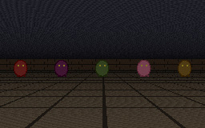
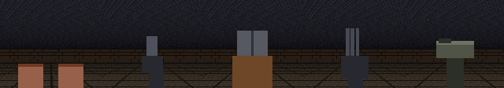
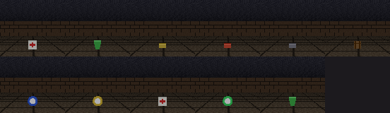
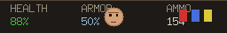
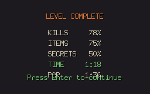
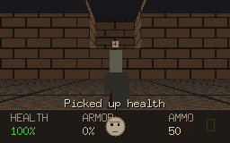

# Demos

A tour of the game's features. Everything here is generated programmatically by
the committed capture tool (`tools/demogen`) straight from the simulation and the
headless renderer — the same pipeline the game uses. Regenerate it all with:

```
just demos        # or: go run ./tools/demogen
```

Each clip runs from a fixed seed, so the captures are reproducible.

## Bestiary



The five demon kinds, each with a distinct silhouette and behaviour: a melee
charger, a fireball-lobbing imp, a hitscan gunner that fires the instant it has a
line on you, a fast low-health pinky, and a slow, heavily-armoured baron.

## Arsenal



The weapons, in selection order: fists (the melee fallback, devastating under
berserk), the precise pistol, the wide-spread shotgun, the rapid-fire chaingun,
and the rocket launcher, whose splash catches whole groups — and other demons in
the blast.

## Pickups & power-ups



Collectibles scattered through every level. The front rank holds the staples —
health and armour, pistol/shotgun/rocket ammo, and a backpack that doubles your
carrying capacity. Behind them sit the power-ups: a soulsphere and megasphere
that push health past the usual maximum, berserk strength, temporary
invulnerability, and a radiation suit that shrugs off damaging floors.

## Status bar



The HUD tracks health and armour, the current weapon's ammo, and the keycards
collected. The face in the centre reacts to damage — wincing toward the
direction a hit came from — and reflects the current health band.

## Level complete



Throwing the exit switch ends the level on a tally — kills, items and secrets as
percentages, and your time against a par derived from the route's length — before
a fresh level is generated to continue into.

## Exploration


Walking a procedurally generated level from the spawn through its rooms and
corridors toward the exit, opening doors along the way, over a textured floor and
under a textured ceiling — past the occasional courtyard open to the sky.

## Combat


Fighting through a level's demons — chargers, pinkies, fireball imps, hitscan
gunners and armoured barons — with the full arsenal, while explosive barrels and
stray shots catch other demons in the crossfire. Demons animate and collapse when
killed; sprites always face the camera and are occluded correctly by nearer walls.

## Automap


Pressing `Tab` overlays an automap that fills in as you explore: walls and floor,
doors (locked ones tinted by their key colour), items, and the player's position
and heading.

## Terrain



Levels are sculpted in quarter-wall steps: climbing a staircase up to a raised
landing, with the camera easing up each step and the ceiling stepping overhead.
Lifts and raised platforms reach ledges that plain steps cannot.
