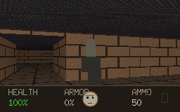
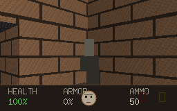
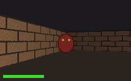
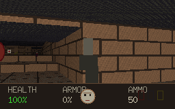
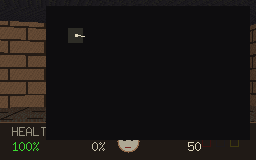

# Demos

Short clips of the game in action. Each is generated from a fixed seed, so the
runs are reproducible.

## Exploration

Walking a procedurally generated level from the spawn through its rooms and
corridors toward the exit, over a textured floor and under a textured ceiling,
with the status bar tracking health, armour, ammo and keys.

## Looking around

A full turn on the spot, showing the per-column raycasting and distance shading
as the walls sweep past.

## Combat

Closing on a billboarded demon — taking damage as it reaches you (watch the
status bar) — then gunning it down with the pistol (note the viewmodel and muzzle
flash). Demons animate and collapse when killed; sprites always face the camera
and are occluded correctly by nearer walls.

## Tally

Reaching the exit shows a level-complete tally — kills, items and secrets as
percentages, plus the time taken — then generates a fresh level to continue into.

## Automap

Pressing `Tab` overlays an automap that fills in as you explore: walls and floor,
doors (locked ones tinted by their key colour), items, and the player's position
and heading.
